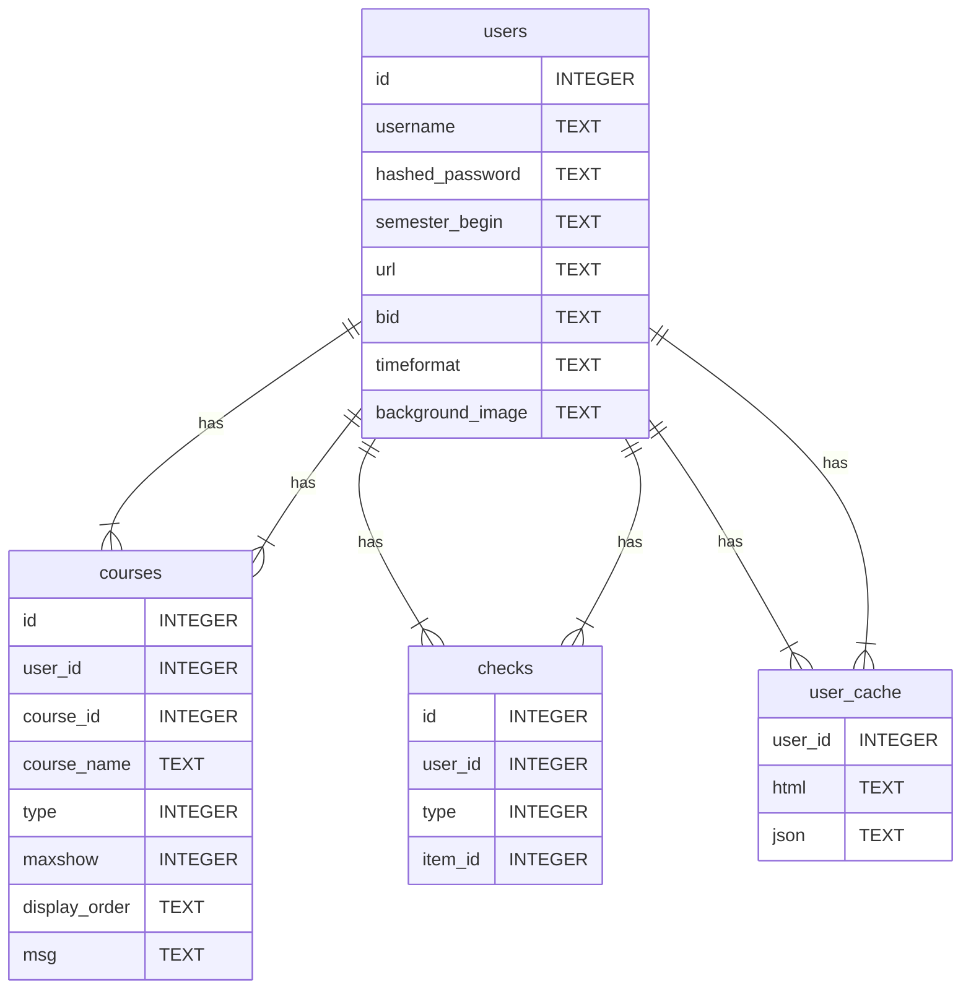

```mermaid
erDiagram
  users ||--|{ courses : has
  users ||--|{ checks : has
  users ||--|{ user_cache : has

  users {
    id INTEGER
    username TEXT
    hashed_password TEXT
    semester_begin TEXT
    url TEXT
    bid TEXT
    timeformat TEXT
    background_image TEXT
  }

  courses {
    id INTEGER
    user_id INTEGER
    course_id INTEGER
    course_name TEXT
    type INTEGER
    maxshow INTEGER
    display_order TEXT
    msg TEXT
  }

  checks {
    id INTEGER
    user_id INTEGER
    type INTEGER
    item_id INTEGER
  }

  user_cache {
    user_id INTEGER
    html TEXT
    json TEXT
  }

  users ||--|{ courses : has
  users ||--|{ checks : has
  users ||--|{ user_cache : has

```
